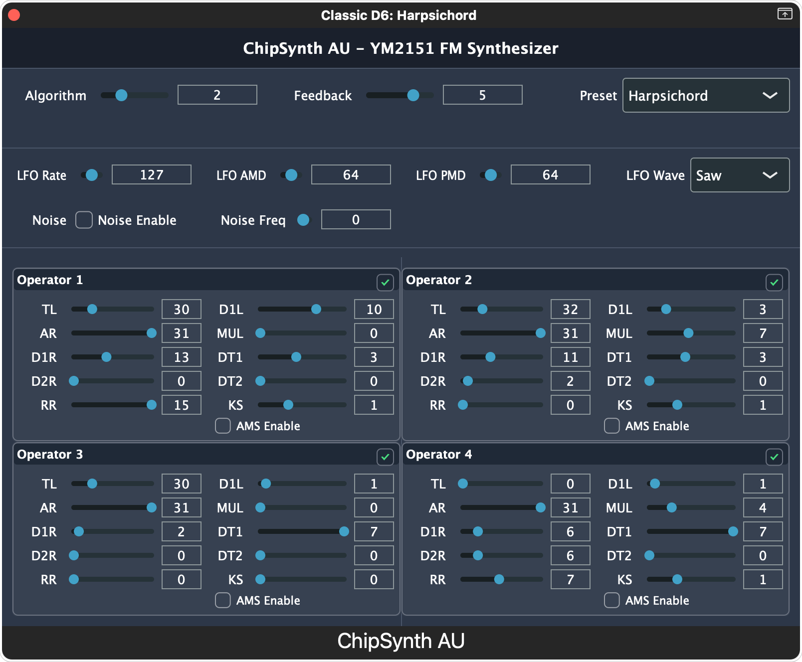

# YMulator Synth

A modern FM synthesis Audio Unit plugin for macOS, bringing the authentic sound of the classic YM2151 (OPM) chip to your DAW with a VOPM-style interface.



## Features

### 🎹 Authentic YM2151 (OPM) Emulation
- **8-voice polyphonic FM synthesis** using Aaron Giles' ymfm library
- **High-precision emulation** of the YM2151 chip from X68000 and arcade systems
- **All 8 FM algorithms** with full operator control
- **Complete parameter set**: DT1, DT2, Key Scale, Feedback, and more

### 🎚️ VOPM-Style Interface
- **4-operator FM synthesis controls** with familiar layout
- **Global parameters**: Algorithm selection and Feedback control
- **Per-operator controls**: TL, AR, D1R, D2R, RR, D1L, KS, MUL, DT1, DT2
- **SLOT enable/disable**: Individual operator ON/OFF control via title bar checkboxes
- **Real-time parameter updates** with < 3ms latency

### 🎵 Professional Features
- **8 Factory Presets**: Electric Piano, Bass, Brass, Strings, Lead, Organ, Bells, Init
- **64 OPM Presets**: Bundled collection of classic FM sounds (⚠️ *currently under sound design refinement*)
- **Full MIDI CC Support**: VOPMex-compatible CC mapping (14-62)
- **Polyphonic voice allocation** with automatic voice stealing
- **Enhanced presets** utilizing DT2, Key Scale, and Feedback for rich timbres
- **LFO support**: AMD/PMD modulation with 4 waveforms (Saw/Square/Triangle/Noise)
- **YM2151 Noise Generator**: Channel 7 hardware-accurate noise synthesis
- **Pitch Bend**: Real-time pitch modulation with configurable range

### 🔧 Modern Workflow
- **Audio Unit v2/v3 compatible** (Music Effect type)
- **64-bit native processing** on Intel and Apple Silicon
- **Full DAW automation support**
- **Optimized for real-time performance**

## Requirements

- macOS 10.13 or later
- Audio Unit compatible DAW (Logic Pro, Ableton Live, GarageBand, etc.)
- 64-bit Intel or Apple Silicon processor

## Installation

### Download Release
1. Download the latest release from the [Releases](https://github.com/hiroaki0923/YMulator-Synth/releases) page
2. Open the DMG file
3. Copy `YMulator Synth.component` to `/Library/Audio/Plug-Ins/Components/`
4. Restart your DAW

### Build from Source
See [Building](#building) section below.

## Quick Start

1. **Load the plugin** in your DAW's instrument track (Music Effect category)
2. **Choose a preset** from the 8 built-in factory presets
3. **Play** using your MIDI keyboard or DAW's piano roll
4. **Adjust parameters** using the VOPM-style interface
5. **Experiment** with DT2, Key Scale, and Feedback for unique sounds

## Building

### Prerequisites
```bash
# Install Xcode Command Line Tools
xcode-select --install

# Install CMake
brew install cmake
```

### Clone and Build
```bash
# Clone repository with submodules
git clone --recursive https://github.com/hiroaki0923/YMulator-Synth.git
cd YMulator-Synth

# Create build directory
mkdir build && cd build

# Configure and build
cmake .. -DCMAKE_BUILD_TYPE=Release
cmake --build .

# Install (copies to ~/Library/Audio/Plug-Ins/Components/)
cmake --install .
```

### Development with VSCode
1. Open the project folder in VSCode
2. Install recommended extensions when prompted
3. Use CMake Tools extension for building and debugging

## Technical Specifications

### Audio Processing
- Sample rates: 44.1, 48, 88.2, 96 kHz supported
- Buffer sizes: 64-4096 samples
- Internal processing: 32-bit float
- Polyphony: 8 voices with automatic voice stealing
- Latency: < 3ms parameter response time

### MIDI Implementation (VOPMex Compatible)
| CC# | Parameter | Range | Description |
|-----|-----------|-------|-------------|
| 14 | Algorithm | 0-7 | FM algorithm selection |
| 15 | Feedback | 0-7 | Operator 1 feedback level |
| 16-19 | TL OP1-4 | 0-127 | Total Level per operator |
| 20-23 | MUL OP1-4 | 0-15 | Multiple per operator |
| 24-27 | DT1 OP1-4 | 0-7 | Detune 1 per operator |
| 28-31 | DT2 OP1-4 | 0-3 | Detune 2 per operator |
| 39-42 | KS OP1-4 | 0-3 | Key Scale per operator |
| 43-46 | AR OP1-4 | 0-31 | Attack Rate per operator |
| 47-50 | D1R OP1-4 | 0-31 | Decay 1 Rate per operator |
| 51-54 | D2R OP1-4 | 0-31 | Decay 2 Rate per operator |
| 55-58 | RR OP1-4 | 0-15 | Release Rate per operator |
| 59-62 | D1L OP1-4 | 0-15 | Sustain Level per operator |

### Factory Presets
| # | Name | Algorithm | Features |
|---|------|-----------|----------|
| 0 | Electric Piano | 5 | DT2 chorusing, rich harmonics |
| 1 | Synth Bass | 7 | Aggressive Key Scale, punch |
| 2 | Brass Section | 4 | Ensemble spread, DT2 variations |
| 3 | String Pad | 1 | Warm feedback, subtle DT2 |
| 4 | Lead Synth | 7 | Sharp attack, complex detuning |
| 5 | Organ | 7 | Harmonic series, organic character |
| 6 | Bells | 1 | Inharmonic relationships |
| 7 | Init | 7 | Basic sine wave template |

## Contributing

We welcome contributions! Please see [CONTRIBUTING.md](CONTRIBUTING.md) for guidelines.

### Development Setup
1. Fork the repository
2. Create a feature branch (`git checkout -b feature/amazing-feature`)
3. Commit your changes (`git commit -m 'Add amazing feature'`)
4. Push to the branch (`git push origin feature/amazing-feature`)
5. Open a Pull Request

### Testing
```bash
# Run unit tests
cd build
ctest --output-on-failure

# Run Audio Unit validation (quiet)
auval -v aumu YMul Hrki > /dev/null 2>&1 && echo "auval PASSED" || echo "auval FAILED"

# Run Audio Unit validation (verbose for debugging)
auval -v aumu YMul Hrki
```

## Current Development Status

This project is actively developed with the following status:
- **Phase 1 (Foundation)**: ✅ 100% Complete
- **Phase 2 (Core Audio)**: ✅ 100% Complete (OPM focused)
- **Phase 3 (UI Enhancement)**: 🔄 30% Complete (SLOT control implemented)
- **Overall Progress**: ~95% Complete

### Version 0.0.3 Features
- **SLOT Control**: Individual operator enable/disable controls via title bar checkboxes
- **VOPM Compatibility**: Full SLOT mask compatibility with existing VOPM presets
- **Enhanced UI**: Improved operator panel layout with SLOT controls
- **Backward Compatibility**: All existing presets remain fully functional

See [docs/ymulatorsynth-development-status.md](docs/ymulatorsynth-development-status.md) for detailed progress tracking.

### Known Issues
- **Preset Quality**: The 64 bundled OPM presets require sound design refinement for authentic instrument sounds
- **Bell Instruments**: Marimba, Vibraphone, and similar percussive sounds need parameter optimization

### Roadmap
- **Phase 2 Completion**: Enhanced UI features, preset quality improvements
- **Phase 3 (Future)**: YM2608 (OPNA) support, .opm file I/O, S98 export

## License

This project is licensed under the GPL v3 License - see [LICENSE](LICENSE) file for details.

### Third-party Libraries
- [JUCE](https://juce.com/) - GPL v3 / Commercial
- [ymfm](https://github.com/aaronsgiles/ymfm) - BSD 3-Clause
- VOPM compatibility inspired by [VOPM](http://www.geocities.jp/sam_kb/VOPM/) by Sam

## Acknowledgments

- Aaron Giles for the amazing ymfm emulation library
- Sam for the original VOPM that inspired this project
- The chiptune community for keeping these sounds alive
- Contributors and testers who helped shape this plugin

## Support

- **Documentation**: [Wiki](https://github.com/hiroaki0923/YMulator-Synth/wiki)
- **Bug Reports**: [Issues](https://github.com/hiroaki0923/YMulator-Synth/issues)
- **Discussions**: [Discussions](https://github.com/hiroaki0923/YMulator-Synth/discussions)

