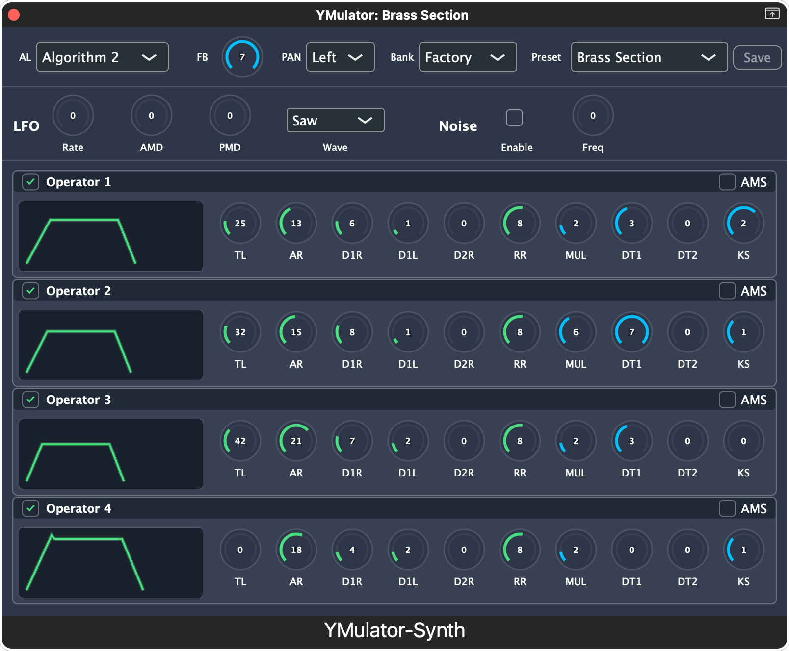

# YMulator Synth

*[日本語版はこちら / Japanese version](README_ja.md)*

A modern FM synthesis Audio Unit plugin for macOS, bringing the authentic sound of the classic YM2151 (OPM) chip to your DAW with an intuitive 4-operator interface.



## Features

### 🎹 Authentic YM2151 (OPM) Emulation
- **8-voice polyphonic FM synthesis** using Aaron Giles' ymfm library
- **High-precision emulation** of the YM2151 chip from X68000 and arcade systems
- **All 8 FM algorithms** with full operator control
- **Complete parameter set**: DT1, DT2, Key Scale, Feedback, and more

### 🎚️ Professional Interface
- **4-operator FM synthesis controls** with intuitive layout
- **Global parameters**: Algorithm selection and Feedback control
- **Global Pan Control**: LEFT/CENTER/RIGHT/RANDOM panning modes
- **Per-operator controls**: TL, AR, D1R, D2R, RR, D1L, KS, MUL, DT1, DT2
- **SLOT enable/disable**: Individual operator ON/OFF control via title bar checkboxes
- **Preset name preservation**: Global pan changes don't affect preset identity
- **Real-time parameter updates** with < 3ms latency

### 🎵 Professional Features
- **8 Factory Presets**: Electric Piano, Bass, Brass, Strings, Lead, Organ, Bells, Init
- **64 OPM Presets**: Bundled collection of classic FM sounds (⚠️ *currently under sound design refinement*)
- **Complete Preset Management**: Bank/Preset dual ComboBox system with OPM file import
- **OPM File Support**: Load .opm preset files exported from VOPM and other compatible applications
- **DAW Project Persistence**: Bank and preset selections survive DAW project save/load
- **Full MIDI CC Support**: VOPMex-compatible CC mapping (14-62)
- **Polyphonic voice allocation** with automatic voice stealing
- **Enhanced presets** utilizing DT2, Key Scale, and Feedback for rich timbres
- **LFO support**: AMD/PMD modulation with 4 waveforms (Saw/Square/Triangle/Noise)
- **YM2151 Noise Generator**: Channel 7 hardware-accurate noise synthesis
- **Pitch Bend**: Real-time pitch modulation with configurable range

### 🔧 Modern Workflow
- **Audio Unit v2/v3 compatible** (Music Effect type)
- **Enhanced DAW compatibility** with GarageBand stability improvements
- **64-bit native processing** on Intel and Apple Silicon
- **Full DAW automation support**
- **Optimized for real-time performance** with audio buffer improvements
- **Cross-platform support**: Windows (VST3), macOS (AU/VST3), Linux (VST3)

## Requirements

### 🪟 Windows
- Windows 10 or later (64-bit)
- VST3 compatible DAW (Ableton Live, FL Studio, Reaper, etc.)

### 🍎 macOS
- macOS 10.13 or later
- Audio Unit compatible DAW (Logic Pro, Ableton Live, GarageBand, etc.)
- 64-bit Intel or Apple Silicon processor

### 🐧 Linux
- Modern Linux distribution (Ubuntu 18.04+, Fedora 30+, etc.)
- VST3 compatible DAW (Reaper, Ardour, Bitwig Studio, etc.)
- 64-bit x86_64 processor

## Installation

### Download Release
Download the latest release from the [Releases](https://github.com/hiroaki0923/YMulator-Synth/releases) page and follow the platform-specific instructions:

#### 🪟 Windows
1. Download `YMulator-Synth-Windows-VST3.zip`
2. Extract the archive
3. Copy `YMulator-Synth.vst3` to `C:\Program Files\Common Files\VST3\`
4. Restart your DAW

#### 🍎 macOS
1. Download the appropriate package:
   - `YMulator-Synth-macOS-AU.zip` (Audio Unit)
   - `YMulator-Synth-macOS-VST3.zip` (VST3)
   - `YMulator-Synth-macOS-Standalone.zip` (Standalone app)
2. Extract the archive
3. Copy plugins to the appropriate directory:
   - **Audio Unit**: `/Library/Audio/Plug-Ins/Components/`
   - **VST3**: `/Library/Audio/Plug-Ins/VST3/`
   - **Standalone**: Install the `.app` to `Applications`
4. Restart your DAW

#### 🐧 Linux
1. Download the appropriate package:
   - `YMulator-Synth-Linux-VST3.tar.gz` (VST3)
   - `YMulator-Synth-Linux-Standalone.tar.gz` (Standalone)
2. Extract the archive: `tar -xzf YMulator-Synth-Linux-VST3.tar.gz`
3. Copy plugins to your VST3 directory:
   - **System-wide**: `/usr/lib/vst3/` (requires sudo)
   - **User-only**: `~/.vst3/`
4. Restart your DAW

### Build from Source
See [Building](#building) section below.

## Quick Start

1. **Load the plugin** in your DAW's instrument track (Music Effect category)
2. **Choose a preset** from the 8 built-in factory presets
3. **Play** using your MIDI keyboard or DAW's piano roll
4. **Adjust parameters** using the intuitive 4-operator interface
5. **Experiment** with DT2, Key Scale, and Feedback for unique sounds

## Building

### Prerequisites

#### 🪟 Windows
```bash
# Install CMake via chocolatey
choco install cmake
# Or download from https://cmake.org/download/

# Install Git
choco install git

# Install Visual Studio 2019/2022 with C++ workload
```

#### 🍎 macOS
```bash
# Install Xcode Command Line Tools
xcode-select --install

# Install CMake and Git
brew install cmake git

# Optional: Install Google Test for testing
brew install googletest
```

#### 🐧 Linux (Ubuntu/Debian)
```bash
# Install dependencies
sudo apt-get update
sudo apt-get install -y \
    cmake \
    build-essential \
    git \
    libgtest-dev \
    libasound2-dev \
    libjack-jackd2-dev \
    libfreetype6-dev \
    libx11-dev \
    libxcomposite-dev \
    libxcursor-dev \
    libxinerama-dev \
    libxrandr-dev \
    libxrender-dev \
    libglu1-mesa-dev
```

### Clone and Build

#### Quick Start (All Platforms)
```bash
# Clone repository with submodules
git clone --recursive https://github.com/hiroaki0923/YMulator-Synth.git
cd YMulator-Synth

# One-time setup
./scripts/build.sh setup

# Build the project
./scripts/build.sh build

# Install plugins (macOS only)
./scripts/build.sh install
```

#### Platform-Specific Build
```bash
# Debug build for development
./scripts/build.sh debug

# Release build for distribution
./scripts/build.sh release

# Clean and rebuild
./scripts/build.sh rebuild

# Just clean build directory
./scripts/build.sh clean
```

#### Manual Build (if scripts don't work)
```bash
# Clone repository with submodules
git clone --recursive https://github.com/hiroaki0923/YMulator-Synth.git
cd YMulator-Synth

# Create and enter build directory
mkdir build && cd build

# Configure (choose one)
cmake .. -DCMAKE_BUILD_TYPE=Release                    # Linux/macOS
cmake .. -G "Visual Studio 17 2022" -A x64            # Windows

# Build
cmake --build . --config Release --parallel

# Install (macOS only - copies to Audio Unit directories)
cmake --install .
```

### Development with VSCode
1. Open the project folder in VSCode
2. Install recommended extensions when prompted (CMake Tools, C/C++)
3. Use CMake Tools extension for building and debugging
4. See `CLAUDE.md` for detailed development setup instructions

## Technical Specifications

### Audio Processing
- Sample rates: 44.1, 48, 88.2, 96 kHz supported
- Buffer sizes: 64-4096 samples
- Internal processing: 32-bit float
- Polyphony: 8 voices with automatic voice stealing
- Latency: < 3ms parameter response time

### MIDI Implementation (VOPMex Compatible)
| CC# | Parameter | Range | Description |
|-----|-----------|-------|-------------|
| 14 | Algorithm | 0-7 | FM algorithm selection |
| 15 | Feedback | 0-7 | Operator 1 feedback level |
| 16-19 | TL OP1-4 | 0-127 | Total Level per operator |
| 20-23 | MUL OP1-4 | 0-15 | Multiple per operator |
| 24-27 | DT1 OP1-4 | 0-7 | Detune 1 per operator |
| 28-31 | DT2 OP1-4 | 0-3 | Detune 2 per operator |
| 39-42 | KS OP1-4 | 0-3 | Key Scale per operator |
| 43-46 | AR OP1-4 | 0-31 | Attack Rate per operator |
| 47-50 | D1R OP1-4 | 0-31 | Decay 1 Rate per operator |
| 51-54 | D2R OP1-4 | 0-31 | Decay 2 Rate per operator |
| 55-58 | RR OP1-4 | 0-15 | Release Rate per operator |
| 59-62 | D1L OP1-4 | 0-15 | Sustain Level per operator |

### Factory Presets
| # | Name | Algorithm | Features |
|---|------|-----------|----------|
| 0 | Electric Piano | 5 | DT2 chorusing, rich harmonics |
| 1 | Synth Bass | 7 | Aggressive Key Scale, punch |
| 2 | Brass Section | 4 | Ensemble spread, DT2 variations |
| 3 | String Pad | 1 | Warm feedback, subtle DT2 |
| 4 | Lead Synth | 7 | Sharp attack, complex detuning |
| 5 | Organ | 7 | Harmonic series, organic character |
| 6 | Bells | 1 | Inharmonic relationships |
| 7 | Init | 7 | Basic sine wave template |

## Contributing

We welcome contributions! Please see [CONTRIBUTING.md](CONTRIBUTING.md) for guidelines.

### Development Setup
1. Fork the repository
2. Create a feature branch (`git checkout -b feature/amazing-feature`)
3. Commit your changes (`git commit -m 'Add amazing feature'`)
4. Push to the branch (`git push origin feature/amazing-feature`)
5. Open a Pull Request

### Testing

#### Quick Testing
```bash
# Run all tests (uses split binaries for speed)
./scripts/test.sh

# Test execution modes
./scripts/test.sh --split           # Split binaries, parallel (default)
./scripts/test.sh --split-seq       # Split binaries, sequential
./scripts/test.sh --unified         # Unified binary (traditional)

# Run specific test categories
./scripts/test.sh --unit           # Unit tests only
./scripts/test.sh --integration    # Integration tests only
./scripts/test.sh --regression     # Regression tests only

# Audio Unit validation (macOS only)
./scripts/test.sh --auval

# Build and test in one command
./scripts/test.sh --build
```

#### Advanced Testing
```bash
# List available tests
./scripts/test.sh --list

# Run tests matching specific pattern
./scripts/test.sh --filter "ParameterManager"
./scripts/test.sh --filter "Pan"

# Show only Google Test output (no debug logs)
./scripts/test.sh --gtest-only

# Quiet mode for CI/automated testing
./scripts/test.sh --quiet

# Verbose mode for debugging
./scripts/test.sh --verbose

# Pass additional arguments to Google Test
./scripts/test.sh --gtest-args "--gtest_repeat=5"
```

#### Manual Testing (if scripts don't work)
```bash
# Run all tests using split binaries (fast parallel execution)
cd build
./bin/YMulatorSynthAU_BasicTests --gtest_brief &
./bin/YMulatorSynthAU_PresetTests --gtest_brief &
./bin/YMulatorSynthAU_ParameterTests --gtest_brief &
./bin/YMulatorSynthAU_PanTests --gtest_brief &
./bin/YMulatorSynthAU_IntegrationTests --gtest_brief &
./bin/YMulatorSynthAU_QualityTests --gtest_brief &
wait

# Run specific test categories
./bin/YMulatorSynthAU_BasicTests         # Basic functionality tests
./bin/YMulatorSynthAU_PresetTests        # Preset management tests
./bin/YMulatorSynthAU_ParameterTests     # Parameter system tests
./bin/YMulatorSynthAU_PanTests           # Pan functionality tests
./bin/YMulatorSynthAU_IntegrationTests   # Component integration tests
./bin/YMulatorSynthAU_QualityTests       # Audio quality tests

# Unified test executable (traditional, slower)
./bin/YMulatorSynthAU_Tests

# Using ctest (runs all test executables)
ctest --output-on-failure

# Audio Unit validation (macOS only)
auval -v aumu YMul Hrki > /dev/null 2>&1 && echo "auval PASSED" || echo "auval FAILED"

# Audio Unit validation (verbose for debugging)
auval -v aumu YMul Hrki
```

## Current Development Status

This project is actively developed with the following status:
- **Phase 1 (Foundation)**: ✅ 100% Complete
- **Phase 2 (Core Audio)**: ✅ 100% Complete (OPM focused)
- **Phase 3 (UI Enhancement)**: ✅ 95% Complete (Preset management system complete)
- **Phase 3+ (Quality Enhancement)**: ✅ 100% Complete (Global pan & DAW compatibility)
- **Overall Progress**: 100% Complete

### Version 0.0.6 Features (Released 2025-06-23)
- **Global Pan System**: LEFT/CENTER/RIGHT/RANDOM panning modes with preset name preservation
- **Enhanced DAW Compatibility**: GarageBand stability improvements and audio buffer optimization
- **Audio Processing Improvements**: Fixed duplicate sound issues and playback delays
- **Optimized Performance**: Reduced CPU load and improved real-time processing

### Version 0.0.5 Features (Released 2025-06-16)
- **Cross-Platform Release**: Windows, macOS, and Linux support
- **Multiple Plugin Formats**: VST3, AU, AUv3, and Standalone applications
- **Enhanced Distribution**: Comprehensive installer packages for all platforms

### Version 0.0.3 Features
- **SLOT Control**: Individual operator enable/disable controls via title bar checkboxes
- **OPM File Compatibility**: Full SLOT mask compatibility with existing .opm preset files
- **Enhanced UI**: Improved operator panel layout with SLOT controls
- **Backward Compatibility**: All existing presets remain fully functional

See [docs/ymulatorsynth-development-status.md](docs/ymulatorsynth-development-status.md) for detailed progress tracking.

### Known Issues
- **Preset Quality**: The 64 bundled OPM presets require sound design refinement for authentic instrument sounds
- **Bell Instruments**: Marimba, Vibraphone, and similar percussive sounds need parameter optimization

### Roadmap
- **Phase 3 Completion**: Enhanced UI features, additional preset management features
- **Phase 4 (Future)**: YM2608 (OPNA) support, S98 export, advanced editing features

## Changelog

### Version 0.0.6 (2025-06-23)
**Quality Enhancement Release: Global Pan & DAW Compatibility**

**🎵 New Features:**
- **Global Pan System**: LEFT/CENTER/RIGHT/RANDOM panning modes for enhanced stereo control
- **Preset Name Preservation**: Global pan changes no longer switch to "Custom" mode
- **Enhanced DAW Compatibility**: Improved GarageBand integration and stability
- **Audio Buffer Optimization**: Fixed duplicate sound and playback delay issues
- **Performance Improvements**: Optimized real-time processing with reduced CPU load

**🔧 Technical Improvements:**
- **Correct ymfm Output Handling**: Fixed audio buffer interpretation (data[0]=left, data[1]=right)
- **Buffer Management**: Implemented proper buffer clearing to prevent audio artifacts
- **Parameter Exception Handling**: Global pan parameters bypass custom preset mode switching
- **YM2151 Register Control**: Accurate panning register manipulation with bit-level precision
- **Resource Management**: Enhanced Audio Unit resource cleanup for stable operation

**🐛 Bug Fixes:**
- Fixed duplicate/overlapping notes during playback
- Resolved 1-2 second audio delay after stopping playback
- Fixed sample rate synchronization issues with various DAWs
- Eliminated audio artifacts from residual buffer data

### Version 0.0.5 (2025-06-16)
**Cross-Platform Release**

**🎵 New Features:**
- **Multi-Platform Support**: Windows, macOS, and Linux binaries
- **Multiple Plugin Formats**: VST3, AU, AUv3, and Standalone versions
- **Enhanced Distribution**: Comprehensive installer packages for all platforms

### Version 0.0.4 (2025-06-15)
**Major Release: Complete Preset Management System**

**🎵 New Features:**
- **Bank/Preset Dual ComboBox System**: Hierarchical preset organization with Factory and imported banks
- **OPM File Import**: Full support for .opm preset files exported from VOPM and compatible applications
- **DAW Project Persistence**: Bank and preset selections automatically restored after DAW restart
- **Enhanced User Experience**: Streamlined UI with File menu removal and optimized layout

**🔧 Technical Improvements:**
- **OPM Parser Robustness**: Fixed whitespace normalization for reliable SLOT mask and noise enable parsing
- **Performance Optimization**: Reduced debug output while maintaining comprehensive error reporting
- **State Management**: ValueTreeState integration for seamless DAW project save/load
- **Memory Management**: Duplicate bank prevention and efficient user data persistence

**🐛 Bug Fixes:**
- Fixed OPM parser handling of multiple spaces/tabs causing incorrect parameter parsing
- Resolved UI layout spacing issues after File menu removal
- Fixed DAW project restore order to load user data before applying presets

### Version 0.0.3 (2025-06-12)
**UI Enhancement Release**

**🎵 New Features:**
- **SLOT Control System**: Individual operator enable/disable via title bar checkboxes
- **OPM File Compatibility**: Full SLOT mask compatibility with existing .opm preset files
- **Visual Feedback**: Clear indication of enabled/disabled operators

**🔧 Technical Improvements:**
- **Backward Compatibility**: All existing presets remain fully functional
- **UI Integration**: Seamless SLOT control integration with parameter system

### Version 0.0.2 (2025-06-11)
**Core Audio Enhancement Release**

**🎵 New Features:**
- **YM2151 Noise Generator**: Hardware-accurate noise synthesis on channel 7
- **LFO Complete Implementation**: 4 waveforms with AMS/PMS modulation
- **Enhanced Envelope System**: Velocity sensitivity and batch optimization

**🔧 Technical Improvements:**
- **Hardware Constraints**: Full YM2151 hardware limitation compliance
- **Performance Optimization**: Efficient envelope processing
- **MIDI CC Expansion**: Additional controllers for noise and LFO parameters

### Version 0.0.1 (2025-06-08)
**Initial Release**

**🎵 Core Features:**
- **YM2151 (OPM) Emulation**: 8-voice polyphonic FM synthesis
- **Professional Interface**: Intuitive 4-operator layout with all parameters
- **8 Factory Presets**: Professional-quality starting sounds
- **MIDI Integration**: Full Note On/Off, CC, and pitch bend support
- **Audio Unit Compatibility**: Native macOS plugin integration

## License

This project is licensed under the GPL v3 License - see [LICENSE](LICENSE) file for details.

### Third-party Libraries
- [JUCE](https://juce.com/) - GPL v3 / Commercial
- [ymfm](https://github.com/aaronsgiles/ymfm) - BSD 3-Clause
- OPM file format compatibility with [VOPM](http://www.geocities.jp/sam_kb/VOPM/) by Sam

## Acknowledgments

- Aaron Giles for the amazing ymfm emulation library
- Sam for the original VOPM and OPM file format
- The chiptune community for keeping these sounds alive
- Contributors and testers who helped shape this plugin

## Support

- **Documentation**: [Wiki](https://github.com/hiroaki0923/YMulator-Synth/wiki)
- **Bug Reports**: [Issues](https://github.com/hiroaki0923/YMulator-Synth/issues)
- **Discussions**: [Discussions](https://github.com/hiroaki0923/YMulator-Synth/discussions)

