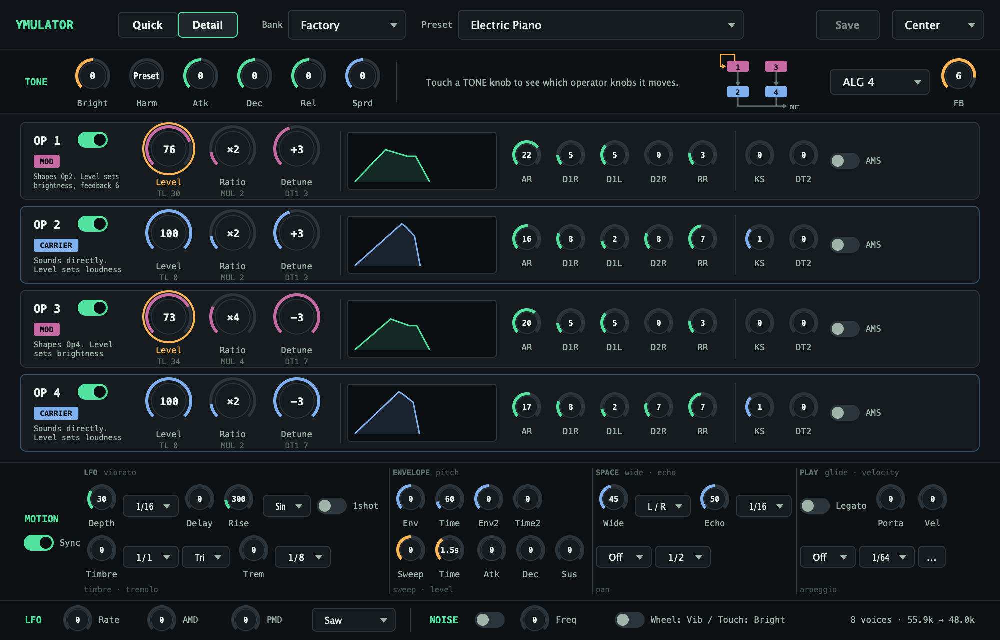

# YMulator Synth

*[English version](README.md)*

YM2151（OPM）を再現する FM シンセサイザープラグインです。音源部は Aaron Giles の ymfm で、その上に「レジスタを直接いじる画面」と「音楽的な言葉で扱う画面」の両方を用意しています。macOS では Audio Unit / VST3 / スタンドアロン、Windows と Linux では VST3 として動きます。


*Quick 画面。TONE のマクロで音を整え、RECIPE で新しい音を作り、MOTION で動きを足し、OUTPUT で結果を見る。*



*Detail 画面。4 オペレーターの全パラメーター。マクロが動かすノブには印が付く。*

## 概要

- **音源**: ymfm による YM2151 のエミュレーション。8 音、8 アルゴリズム、DT1 / DT2 / KS / フィードバック、4 波形の LFO、ノイズジェネレーター。チップの出力（55.9 kHz）をホストのサンプルレートに変換して出します。
- **2 つの画面**: Quick 画面はマクロと機能単位のスイッチ、Detail 画面はレジスタ単位のノブ。どちらも同じパラメーターを見ているので、切り替えで音は変わりません。
- **TONE マクロ**: Brightness / Harmonics / Attack / Decay / Release / Spread。読み込んだプリセットを基準に、関係するオペレーターのパラメーターをまとめて動かします。Detail でレジスタを直接変えると、その値がマクロの新しい基準になります。
- **RECIPE**: カテゴリ（Bass / Lead / Brass / E.Piano / Bell / Pad / SE / Any）と 6 本のスライダーで方向を決めて Generate。Undo と A/B で前の音と聴き比べられます。
- **MOTION**: パラメーターを時間で動かす機能のまとめ。Wide（2 台目のチップを少しずらして反対側で鳴らす。8 音のまま）、Echo（遅らせた小さめの音を左右交互に置く）、ディレイとライズ付きのビブラート、音色 LFO、トレモロ、パンの配置と移動（左 / 右 / 音ごとにランダム / 交互 / 拍で移動）、2 段のピッチエンベロープ、明るさのスイープ、レベルエンベロープ、ポルタメント / レガート、ベロシティ→明るさ。レートはホストのテンポに音価で同期できます。
- **アルペジエーター**: 押さえた音を Up / Down / Up-Down / Random / 押した順で回します。オクターブは 1〜4。1 チャンネルで音程だけを切り替える方式（1/64 まで）と、ゲート付きで毎ステップ発音し直す方式があります。コード表で単音を和音にでき、Latch で手を離しても続き、アクセントで拍を強められます。
- **OUTPUT**: 現在の設定で 1 音鳴らした波形と包絡線を、鳴り始めからリリースまで再生表示します。無音の設定では理由を表示します。
- **プリセット**: ファクトリー 8 音色とコレクション 64 音色。VOPM 形式の `.opm` バンクを読み込め、自分の音色も保存できます。バンクとプリセットの選択は DAW のプロジェクトに保存されます。
- **MIDI**: 全パラメーターの VOPMex 互換 CC、マクロと MOTION の量の CC、モジュレーションホイールとアフタータッチを使う Expressive モード。

## 動作環境

| プラットフォーム | 形式 | 必要なもの |
|---|---|---|
| macOS 10.13 以降、Intel / Apple Silicon | Audio Unit、VST3、スタンドアロン | AU または VST3 ホスト（Logic Pro、GarageBand、Ableton Live、Reaper など） |
| Windows 10 以降、64 bit | VST3 | VST3 ホスト（Ableton Live、FL Studio、Reaper など） |
| Linux、x86_64 | VST3、スタンドアロン | VST3 ホスト（Reaper、Ardour、Bitwig Studio など） |

## インストール

[Releases](https://github.com/hiroaki0923/YMulator-Synth/releases) からプラットフォームのパッケージをダウンロードして展開し、プラグインを所定のフォルダにコピーしてから DAW を再スキャンまたは再起動してください。

| パッケージ | コピー先 |
|---|---|
| `YMulator-Synth-macOS-AU.zip` | `~/Library/Audio/Plug-Ins/Components/`（または `/Library/Audio/Plug-Ins/Components/`） |
| `YMulator-Synth-macOS-VST3.zip` | `~/Library/Audio/Plug-Ins/VST3/`（または `/Library/Audio/Plug-Ins/VST3/`） |
| `YMulator-Synth-macOS-Standalone.zip` | `/Applications/` |
| `YMulator-Synth-Windows-VST3.zip` | `C:\Program Files\Common Files\VST3\` |
| `YMulator-Synth-Linux-VST3.tar.gz` | `~/.vst3/`（または `/usr/lib/vst3/`） |
| `YMulator-Synth-Linux-Standalone.tar.gz` | 任意の場所。バイナリを直接実行 |

macOS で Audio Unit がすぐに出てこないときは `killall -9 AudioComponentRegistrar` を実行するか、ログアウトして入り直してください。ソースからのビルドは [ビルド](#ビルド) を参照。

## 使いかた

1. インストゥルメントトラックに YMulator Synth を挿します。トラックは**ステレオ**にしてください。Wide、Echo、パンの移動は左右のチャンネルを使います。
2. ヘッダーでバンクとプリセットを選びます。最初のバンクがファクトリー、次がコレクションです。
3. 弾きます。ベロシティはキャリアの音量にだけ効くので、弱く弾いても音色は変わりません。
4. **TONE** のノブで音を整えます。ノブは上下ドラッグで動き、Shift を押しながらだと 10 倍細かく動きます。ホイールも使えます。ノブをダブルクリックすると数値を直接入力できます（ノブが扱う生の値。TL なら 0〜127、時間なら ms）。Return で確定、Escape で取り消し。コントロールに触れるとツールチップが出ます。
5. **MOTION** カードのチップを押すと、その機能が入ります。量は下のノブで決めます。複数同時に使えます。
6. RECIPE カードの **Generate** で、選んだ方向の新しい音ができます。**Undo** で前の音に戻り、**A / B** で 2 つを聴き比べられます。
7. レジスタ単位で触りたいときは **Detail** を押します。

### Quick 画面

- **RECIPE**: カテゴリと 6 本のスライダー（暗い / 明るい、単純 / 複雑、柔らかい / 硬いアタック、短い / 長い、静か / 動く、倍音的 / 金属的）で方向を決め、Generate で作ります。現在の音を置き換え、TONE のノブは中央に戻ります。プリセット欄は「Generated」になります。
- **TONE**: いま読み込まれている音（プリセットでも生成した音でも）に効く 6 つのマクロ。Brightness はモジュレーターのレベル、Harmonics は周波数比のテンプレート（Preset / Saw / Square / Pulse / Bright / Bell / Metal / Sub / Octave）、Attack / Decay / Release はキャリアのエンベロープ（音量。モジュレーターの音色エンベロープはパッチのまま）、Spread は DT1 のばらつきです。プリセットの読み込みや生成で中央に戻ります。
- **ALGORITHM**: 8 つの接続を図で表示します。フィードバックが有効なときはループを強調します。Feedback のノブはここにあります。マクロではなく接続の一部だからです。
- **MOTION**: 機能ごとのチップ（Wide / Vib / Growl / Echo / Sweep / Swell / Glide / Arp / Kick / Trem / Pan）。押すと標準的な値で入り、ノブで量を決めます。**Sync** を入れるとレートがホストのテンポに追従し、Vib rate のノブが音価の選択に変わります。ほかの音価は Detail 画面にあります。
- **OUTPUT**: 現在の音色を 1 音鳴らした結果です。包絡線の上を再生位置が進み、その位置の波形を表示するので、アタック・ディケイ・リリースの違いが見えます。

### Detail 画面

- 上段に TONE 行があり、右端にアルゴリズムの選択と Feedback のノブがあります。TONE のノブに触れると、それが動かすオペレーターのノブに琥珀色の輪が付きます。
- オペレーターの各行には、役割（MOD / CARRIER。ノイズ有効時は NOISE）、主なノブ 3 つ（Level / Ratio / Detune。分かりやすい単位で表示し、レジスタ値を添える）、エンベロープの図、エンベロープの 5 ノブ、KS / DT2 / AMS があります。スイッチでオペレーターを ON / OFF できます（.opm の SLOT マスク）。
- MOTION 行には MOTION の全パラメーターが 4 枚のカードに分かれて並びます。LFO（ビブラート、音色 LFO、トレモロ）、ENVELOPE（ピッチエンベロープ、Sweep、レベルエンベロープ）、SPACE（Wide、Echo、パン）、PLAY（レガートとポルタメント、ベロシティ→明るさ、アルペジオ。「…」ボタンでコード表・オクターブ・リトリガーとゲート・Latch・アクセント）。各カードは上段と下段に何があるかをラベルで示します。Sync ON のときは各レートノブが音価の選択に変わります。
- 最下段はハードウェア LFO（レート、AMD、PMD、波形）、ノイズジェネレーター（ON / OFF と周波数）、Expressive MIDI のスイッチです。

### プリセットと .opm ファイル

- **Factory**（8）: Electric Piano、Synth Bass、Brass Section、String Pad、Lead Synth、Organ、Bells、Init。
- **Collection**（64）: 定番の FM 音色。
- **読み込み**: Bank の「Import OPM File...」で VOPM 形式の `.opm` バンクを読み込みます。読み込んだバンクは `~/Library/YMulator-Synth/banks/`（macOS）に複製され、以後すべてのインスタンスに現れます。
- **保存**: 編集後に **Save** を押すと User バンクに新しいプリセットとして保存されます。保存される値はチップが鳴らしている値そのものです。
- レジスタを変えるとプリセット欄に EDITED タグが付き、Generate の後は「Generated」と表示されます。

## MIDI

ピッチベンド（範囲 1〜12 半音、既定 2）、キャリアに効くベロシティ、Expressive モードでのチャンネルプレッシャーと CC 1、そして下のコントローラーに対応します。ノートは 8 チャンネルに動的に割り当てられ、足りなくなると一番古い音が奪われます。

### コントローラー（VOPMex 互換）

| CC# | パラメーター | 範囲 | 説明 |
|-----|------------|------|------|
| 14 | アルゴリズム | 0-7 | FM アルゴリズム選択 |
| 15 | フィードバック | 0-7 | オペレーター 1 のフィードバック |
| 16-19 | TL OP1-4 | 0-127 | オペレーターごとのトータルレベル |
| 20-23 | MUL OP1-4 | 0-15 | オペレーターごとの倍率 |
| 24-27 | DT1 OP1-4 | 0-7 | オペレーターごとのデチューン 1 |
| 28-31 | DT2 OP1-4 | 0-3 | オペレーターごとのデチューン 2 |
| 39-42 | KS OP1-4 | 0-3 | オペレーターごとのキースケール |
| 43-46 | AR OP1-4 | 0-31 | アタックレート |
| 47-50 | D1R OP1-4 | 0-31 | ディケイ 1 レート |
| 51-54 | D2R OP1-4 | 0-31 | ディケイ 2 レート |
| 55-58 | D1L OP1-4 | 0-15 | サステインレベル |
| 59-62 | RR OP1-4 | 0-15 | リリースレート |
| 70-73 | AME OP1-4 | 0-1 | AMS 有効 |
| 1 | LFO 周波数 | 0-127 | 8 ビット LFRQ の上位 7 ビット。最下位ビットは CC 33 |
| 2 | LFO PMD | 0-127 | ピッチ変調深度 |
| 3 | LFO AMD | 0-127 | 振幅変調深度 |
| 12 | LFO 波形 | 0-3 | Saw / Square / Triangle / Noise |
| 75 | LFO PMS | 0-7 | ピッチ変調感度（全チャンネル共通） |
| 76 | LFO AMS | 0-3 | 振幅変調感度（全チャンネル共通） |
| 80 | ノイズ有効 | 0 / 1-127 | チャンネル 8 のノイズ ON/OFF |
| 82 | ノイズ周波数 | 0-31 | NFRQ（81 も受け付け） |
| 102-107 | Quick マクロ | 位置 | Brightness / Harmonics / Attack / Decay / Release / Spread（64 が中央） |
| 110-118 | Motion の量 | 位置 | Wide / Vibrato / Timbre / Echo / Sweep / Swell / Porta / Pitch / Velocity brightness |
| 108 | アルペジオのコード表 | 位置 | None / Major / Minor / 7th / m7 / Maj7 / Sus4 / Sus2 / Dim / Aug / 5th / Octave |
| 109 | アルペジオのオクターブ | 位置 | 1〜4 |
| 119 | アルペジオのゲート | 位置 | ステップの 10〜100%（Retrig 時） |
| 121 | Reset All Controllers | - | ナチュラルモードに戻し、マクロを中央へ |

マクロの CC は、レジスタ CC で決めた値を基準にした相対的な動きです。レジスタ CC を送るとマクロの基準がそこに移り、マクロ CC はその周りを動くので、両方を併用できます。Motion の CC はレジスタのパラメーターには触れません。Detail 画面の最下段にある **Expressive MIDI** をオンにすると、CC 1 がビブラートの深さ、アフタータッチが Brightness になります。

既定（VOPMex の「ナチュラル」モード）では CC の 0-127 をパラメーターの範囲に拡縮し、TL / AR / D1R / D1L / D2R / RR はレジスタと逆向き（CC 127 が最大音量 / 最速）になります。アナログシンセと同じ感覚です。NRPN 126/127 にデータ 127（CC 99=126、CC 98=127、CC 6=127）を送るとレジスタ値入力モードになり、CC 値がそのままレジスタ値になります。データ 0 でナチュラルモードに戻ります。

## ビルド

### 必要なもの

- CMake 3.22 以降と Git。
- **macOS**: Xcode Command Line Tools（`xcode-select --install`）。テストを動かすなら `brew install googletest`。
- **Windows**: Visual Studio 2022 以降と C++ ワークロード。
- **Linux**（Ubuntu / Debian）: `cmake build-essential git libgtest-dev libasound2-dev libjack-jackd2-dev libfreetype6-dev libx11-dev libxcomposite-dev libxcursor-dev libxinerama-dev libxrandr-dev libxrender-dev libxi-dev libglu1-mesa-dev`。

JUCE は CMake が取得します。ymfm はサブモジュールです。

### ビルド手順

```bash
git clone --recursive https://github.com/hiroaki0923/YMulator-Synth.git
cd YMulator-Synth
./scripts/build.sh setup     # 初回のみ
./scripts/build.sh build     # ほかに debug, release, rebuild, clean
```

macOS ではビルド時に AU と VST3 が `~/Library/Audio/Plug-Ins/` にコピーされ、DAW から見えるようになります。スクリプトを使わない場合:

```bash
mkdir build && cd build
cmake .. -DCMAKE_BUILD_TYPE=Release        # Windows: cmake .. -A x64
cmake --build . --config Release --parallel
```

### テスト

```bash
./scripts/test.sh              # 全テスト。分割バイナリを並列実行
./scripts/test.sh --filter Motion
./scripts/test.sh --auval      # Audio Unit の検証（macOS）
```

`build/` から直接なら `ctest --output-on-failure`、`bin/YMulatorSynthAU_*Tests` の各バイナリ、`auval -v aumu YMul Hrki`。テストはチップで音をレンダリングして確かめるので、パラメーターを露出させたまま配線し忘れたり、違うオペレーターを動かしたりするとテストが落ちます。

`bin/YMulatorSynthAU_UISnapshot` はホストなしでエディターを PNG に描画し（[tools/README.md](tools/README.md)）、`bin/YMulatorSynthAU_SongRender` は MIDI ファイルをプラグインで WAV に描画します。

## ドキュメント

- [CHANGELOG_ja.md](CHANGELOG_ja.md)（日本語）/ [CHANGELOG.md](CHANGELOG.md)（英語）
- [構成](docs/ymulatorsynth-architecture.md)、[YM2151 レジスタの事実集](docs/ym2151-register-facts.md)、[技術仕様](docs/ymulatorsynth-technical-spec.md)（MIDI CC、パラメーター）、[.opm 形式](docs/ymulatorsynth-vopm-format-spec.md)
- [Quick 画面の設計](docs/ymulatorsynth-quick-panel-design.md)、[Motion の設計](docs/ymulatorsynth-motion-design.md)、[アーキテクチャ決定記録](docs/ymulatorsynth-adr.md)、[環境構築とテストの手引き](docs/ymulatorsynth-implementation-guide.md)
- [開発状況](docs/ymulatorsynth-development-status.md)

## コントリビューション

Issue と Pull Request を歓迎します。フォークしてブランチを切り、テストを通したまま（`./scripts/test.sh`）`main` に向けて Pull Request を出してください。コードベースの決まりごとは `CLAUDE.md` にあります。

## ライセンス

GPL v3。[LICENSE](LICENSE) を参照してください。

- [JUCE](https://juce.com/) - GPL v3 / 商用
- [ymfm](https://github.com/aaronsgiles/ymfm) - BSD 3-Clause
- `.opm` ファイルは Sam 氏の VOPM と互換

## 謝辞

- ymfm を作った Aaron Giles 氏
- VOPM と .opm 形式を作った Sam 氏
- この音を今も鳴らし続けているチップチューンのコミュニティ

## サポート

- 不具合報告: [Issues](https://github.com/hiroaki0923/YMulator-Synth/issues)
- 質問: [Discussions](https://github.com/hiroaki0923/YMulator-Synth/discussions)
