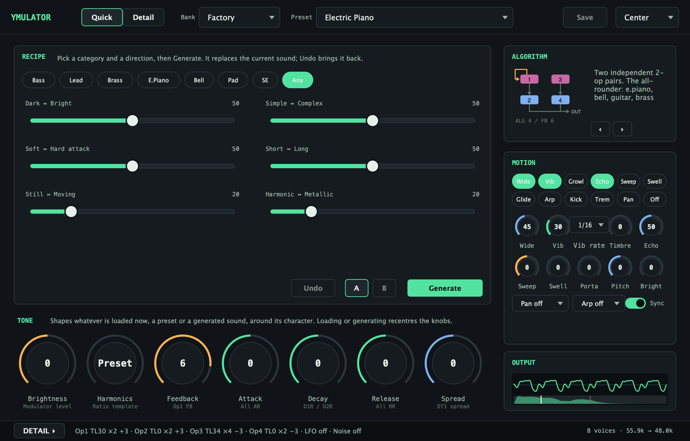

# YMulator Synth

クラシックなYM2151 (OPM) チップの本格的なサウンドを、直感的な4オペレーター・インターフェースでDAWに提供する、モダンなFMシンセシス Audio Unit プラグインです。



## 機能

### 🎹 本格的なYM2151 (OPM) エミュレーション
- **8ボイス・ポリフォニックFMシンセシス** Aaron Giles のymfmライブラリを使用
- **高精度エミュレーション** X68000やアーケードシステムのYM2151チップ
- **全8種類のFMアルゴリズム** 完全なオペレーター制御
- **完全なパラメーターセット**: DT1、DT2、Key Scale、Feedbackなど

### 🎚️ プロフェッショナルなインターフェース
- **4オペレーターFMシンセシス制御** 直感的なレイアウト
- **グローバルパラメーター**: アルゴリズム選択とフィードバック制御
- **グローバルパン制御**: LEFT/CENTER/RIGHT/RANDOMパンニングモード
- **オペレーター毎の制御**: TL、AR、D1R、D2R、RR、D1L、KS、MUL、DT1、DT2
- **SLOT有効/無効**: タイトルバーのチェックボックスによる個別オペレーターON/OFF制御
- **プリセット名の保持**: グローバルパン変更時もプリセット名を維持
- **リアルタイムパラメーター更新** 3ms未満のレイテンシー

### 🎵 プロフェッショナル機能
- **8つのファクトリープリセット**: Electric Piano、Bass、Brass、Strings、Lead、Organ、Bells、Init
- **64のOPMプリセット**: クラシックなFMサウンドのバンドルコレクション（⚠️ *現在サウンドデザイン調整中*）
- **完全なプリセット管理**: Bank/Preset デュアルComboBoxシステム、OPMファイルインポート
- **OPMファイルサポート**: VOPMなど互換アプリケーションからエクスポートされた.opmプリセットファイルの読み込み
- **DAWプロジェクト永続化**: Bank/Presetの選択がDAWプロジェクト保存/読み込み時も維持
- **完全なMIDI CCサポート**: VOPMex互換CCマッピング (14-62)
- **ポリフォニック・ボイス・アロケーション** 自動ボイススティーリング
- **強化されたプリセット** DT2、Key Scale、Feedbackを活用したリッチな音色
- **LFOサポート**: AMD/PMDモジュレーション、4波形（Saw/Square/Triangle/Noise）
- **YM2151ノイズジェネレーター**: チャンネル7のハードウェア精密ノイズ合成
- **ピッチベンド**: 設定可能な範囲でのリアルタイムピッチモジュレーション

### 🔧 モダンなワークフロー
- **Audio Unit v2/v3 互換** (Music Effect type)
- **強化されたDAW互換性** GarageBandでの安定性向上
- **64ビットネイティブ処理** IntelおよびApple Silicon
- **完全なDAWオートメーションサポート**
- **リアルタイムパフォーマンス最適化** オーディオバッファ改善
- **クロスプラットフォームサポート**: Windows (VST3)、macOS (AU/VST3)、Linux (VST3)

## 動作環境

### 🪟 Windows
- Windows 10以降（64ビット）
- VST3対応DAW（Ableton Live、FL Studio、Reaperなど）

### 🍎 macOS
- macOS 10.13以降
- Audio Unit対応DAW（Logic Pro、Ableton Live、GarageBandなど）
- 64ビット IntelまたはApple Siliconプロセッサー

### 🐧 Linux
- モダンなLinuxディストリビューション（Ubuntu 18.04+、Fedora 30+など）
- VST3対応DAW（Reaper、Ardour、Bitwig Studioなど）
- 64ビット x86_64プロセッサー

## インストール

### リリース版のダウンロード
[Releases](https://github.com/hiroaki0923/YMulator-Synth/releases) ページから最新リリースをダウンロードし、プラットフォーム固有の手順に従ってください：

#### 🪟 Windows
1. `YMulator-Synth-Windows-VST3.zip` をダウンロード
2. アーカイブを展開
3. `YMulator-Synth.vst3` を `C:\Program Files\Common Files\VST3\` にコピー
4. DAWを再起動

#### 🍎 macOS
1. 適切なパッケージをダウンロード：
   - `YMulator-Synth-macOS-AU.zip` (Audio Unit)
   - `YMulator-Synth-macOS-VST3.zip` (VST3)
   - `YMulator-Synth-macOS-Standalone.zip` (スタンドアロンアプリ)
2. アーカイブを展開
3. 適切なディレクトリにプラグインをコピー：
   - **Audio Unit**: `/Library/Audio/Plug-Ins/Components/`
   - **VST3**: `/Library/Audio/Plug-Ins/VST3/`
   - **スタンドアロン**: `.app` を `Applications` にインストール
4. DAWを再起動

#### 🐧 Linux
1. 適切なパッケージをダウンロード：
   - `YMulator-Synth-Linux-VST3.tar.gz` (VST3)
   - `YMulator-Synth-Linux-Standalone.tar.gz` (スタンドアロン)
2. アーカイブを展開： `tar -xzf YMulator-Synth-Linux-VST3.tar.gz`
3. VST3ディレクトリにプラグインをコピー：
   - **システム全体**: `/usr/lib/vst3/` (sudoが必要)
   - **ユーザー専用**: `~/.vst3/`
4. DAWを再起動

### ソースからのビルド
下記の[ビルド](#ビルド)セクションを参照してください。

## クイックスタート

1. **プラグインを読み込み** DAWのインストゥルメント・トラック（Music Effectカテゴリ）
2. **プリセットを選択** 8つの内蔵ファクトリープリセットから選択
3. **演奏** MIDIキーボードまたはDAWのピアノロールを使用
4. **パラメーター調整** 直感的な4オペレーター・インターフェースを使用
5. **実験** DT2、Key Scale、Feedbackでユニークなサウンドを作成

## ビルド

### 前提条件

#### 🪟 Windows
```bash
# Chocolatey経由でCMakeをインストール
choco install cmake
# または https://cmake.org/download/ からダウンロード

# Gitをインストール
choco install git

# Visual Studio 2019/2022をC++ワークロードでインストール
```

#### 🍎 macOS
```bash
# Xcode Command Line Toolsをインストール
xcode-select --install

# CMakeとGitをインストール
brew install cmake git

# オプション: テスト用にGoogle Testをインストール
brew install googletest
```

#### 🐧 Linux (Ubuntu/Debian)
```bash
# 依存関係をインストール
sudo apt-get update
sudo apt-get install -y \
    cmake \
    build-essential \
    git \
    libgtest-dev \
    libasound2-dev \
    libjack-jackd2-dev \
    libfreetype6-dev \
    libx11-dev \
    libxcomposite-dev \
    libxcursor-dev \
    libxinerama-dev \
    libxrandr-dev \
    libxrender-dev \
    libglu1-mesa-dev
```

### クローンとビルド

#### クイックスタート（全プラットフォーム）
```bash
# サブモジュールと一緒にリポジトリをクローン
git clone --recursive https://github.com/hiroaki0923/YMulator-Synth.git
cd YMulator-Synth

# 初回セットアップ
./scripts/build.sh setup

# プロジェクトをビルド
./scripts/build.sh build

# プラグインをインストール（macOSのみ）
./scripts/build.sh install
```

#### プラットフォーム固有のビルド
```bash
# 開発用デバッグビルド
./scripts/build.sh debug

# 配布用リリースビルド
./scripts/build.sh release

# クリーンして再ビルド
./scripts/build.sh rebuild

# ビルドディレクトリのみクリーン
./scripts/build.sh clean
```

#### 手動ビルド（スクリプトが動作しない場合）
```bash
# サブモジュールと一緒にリポジトリをクローン
git clone --recursive https://github.com/hiroaki0923/YMulator-Synth.git
cd YMulator-Synth

# ビルドディレクトリを作成して移動
mkdir build && cd build

# 設定（いずれかを選択）
cmake .. -DCMAKE_BUILD_TYPE=Release                    # Linux/macOS
cmake .. -G "Visual Studio 17 2022" -A x64            # Windows

# ビルド
cmake --build . --config Release --parallel

# インストール（macOSのみ - Audio Unitディレクトリにコピー）
cmake --install .
```

### VSCodeでの開発
1. VSCodeでプロジェクトフォルダーを開く
2. 推奨拡張機能のインストールを求められたらインストール（CMake Tools、C/C++）
3. CMake Tools拡張機能を使用してビルドとデバッグ
4. 詳細な開発環境セットアップは `CLAUDE.md` を参照

## 技術仕様

### オーディオ処理
- サンプルレート: 44.1、48、88.2、96 kHz対応
- バッファサイズ: 64-4096サンプル
- 内部処理: 32ビットfloat
- ポリフォニー: 自動ボイススティーリング付き8ボイス
- レイテンシー: パラメーター応答時間 < 3ms

### MIDI実装（VOPMex互換）
| CC# | パラメーター | 範囲 | 説明 |
|-----|-------------|------|-----|
| 14 | Algorithm | 0-7 | FMアルゴリズム選択 |
| 15 | Feedback | 0-7 | オペレーター1フィードバックレベル |
| 16-19 | TL OP1-4 | 0-127 | オペレーター毎のトータルレベル |
| 20-23 | MUL OP1-4 | 0-15 | オペレーター毎のマルチプル |
| 24-27 | DT1 OP1-4 | 0-7 | オペレーター毎のデチューン1 |
| 28-31 | DT2 OP1-4 | 0-3 | オペレーター毎のデチューン2 |
| 39-42 | KS OP1-4 | 0-3 | オペレーター毎のキースケール |
| 43-46 | AR OP1-4 | 0-31 | オペレーター毎のアタックレート |
| 47-50 | D1R OP1-4 | 0-31 | オペレーター毎のディケイ1レート |
| 51-54 | D2R OP1-4 | 0-31 | オペレーター毎のディケイ2レート |
| 55-58 | D1L OP1-4 | 0-15 | オペレーター毎のサスティンレベル |
| 59-62 | RR OP1-4 | 0-15 | オペレーター毎のリリースレート |
| 70-73 | AME OP1-4 | 0-1 | オペレーター毎の AMS 有効 |
| 1 | LFO 周波数 | 0-127 | 8 ビット LFRQ の上位 7 ビット。最下位ビットは CC 33 |
| 2 | LFO PMD | 0-127 | ピッチ変調深度 |
| 3 | LFO AMD | 0-127 | 振幅変調深度 |
| 12 | LFO 波形 | 0-3 | Saw / Square / Triangle / Noise |
| 80 | ノイズ有効 | 0 / 1-127 | チャンネル 8 のノイズ |
| 75 | LFO PMS | 0-7 | ピッチ変調感度（全チャンネル共通） |
| 76 | LFO AMS | 0-3 | 振幅変調感度（全チャンネル共通） |
| 82 | ノイズ周波数 | 0-31 | NFRQ（81 も受け付け） |
| 102-107 | Quick マクロ | 位置 | Brightness / Harmonics / Attack / Decay / Release / Spread（64 が中央） |
| 110-118 | Motion の量 | 位置 | Wide / Vibrato / Timbre / Echo / Sweep / Swell / Porta / Pitch / Velocity brightness |
| 121 | Reset All Controllers | - | ナチュラルモードに戻し、マクロを中央へ |

マクロの CC は、レジスタ CC で決めた値を基準にした相対的な動きです。レジスタ CC を送るとマクロの基準がそこに移り、マクロ CC はその周りを動くので、両方を併用できます。Motion の CC はレジスタのパラメーターには触れません。Detail 画面の最下段にある **Expressive MIDI** をオンにすると、CC 1 がビブラートの深さ、アフタータッチが Brightness になります。

既定（VOPMex の「ナチュラル」モード）では、0〜127 の CC 値をパラメーターの範囲へスケールし、TL・AR・D1R・D1L・D2R・RR はレジスタと逆向き（CC 127 = 最大音量・最速）になります。アナログシンセの操作感覚に合わせたものです。NRPN 126/127・データ 127（CC 99=126, CC 98=127, CC 6=127）でレジスタ値入力モードに切り替わり、CC 値がそのままレジスタ値になります。データ 0 でナチュラルモードに戻ります。

### ファクトリープリセット
| # | 名前 | アルゴリズム | 特徴 |
|---|------|-------------|------|
| 0 | Electric Piano | 5 | DT2コーラス、リッチハーモニクス |
| 1 | Synth Bass | 7 | アグレッシブなKey Scale、パンチ |
| 2 | Brass Section | 4 | アンサンブルスプレッド、DT2バリエーション |
| 3 | String Pad | 1 | ウォームフィードバック、サブトルDT2 |
| 4 | Lead Synth | 7 | シャープアタック、コンプレックスデチューン |
| 5 | Organ | 7 | ハーモニックシリーズ、オーガニックキャラクター |
| 6 | Bells | 1 | 非調和関係 |
| 7 | Init | 7 | 基本サイン波テンプレート |

## 貢献

貢献を歓迎します！ガイドラインについては [CONTRIBUTING.md](CONTRIBUTING.md) を参照してください。

### 開発セットアップ
1. リポジトリをフォーク
2. フィーチャーブランチを作成（`git checkout -b feature/amazing-feature`）
3. 変更をコミット（`git commit -m 'Add amazing feature'`）
4. ブランチにプッシュ（`git push origin feature/amazing-feature`）
5. プルリクエストを開く

### テスト

#### クイックテスト
```bash
# 全テストを実行
./scripts/test.sh

# 特定のテストカテゴリを実行
./scripts/test.sh --unit           # ユニットテストのみ
./scripts/test.sh --integration    # インテグレーションテストのみ
./scripts/test.sh --regression     # リグレッションテストのみ

# Audio Unit検証（macOSのみ）
./scripts/test.sh --auval

# ビルドとテストを一つのコマンドで
./scripts/test.sh --build
```

#### 高度なテスト
```bash
# 利用可能なテストを一覧表示
./scripts/test.sh --list

# 特定のパターンにマッチするテストを実行
./scripts/test.sh --filter "ParameterManager"
./scripts/test.sh --filter "Pan"

# Google Testの結果のみ表示（デバッグログなし）
./scripts/test.sh --gtest-only

# CI/自動テスト用クワイエットモード
./scripts/test.sh --quiet

# デバッグ用詳細モード
./scripts/test.sh --verbose

# Google Testに追加引数を渡す
./scripts/test.sh --gtest-args "--gtest_repeat=5"
```

#### 手動テスト（スクリプトが動作しない場合）
```bash
# ユニットテストを実行
cd build
ctest --output-on-failure

# 特定のテスト実行ファイルを実行
./bin/YMulatorSynthAU_Tests

# Audio Unit検証（macOSのみ）
auval -v aumu YMul Hrki > /dev/null 2>&1 && echo "auval PASSED" || echo "auval FAILED"

# Audio Unit検証（デバッグ用詳細表示）
auval -v aumu YMul Hrki
```

## 現在の開発状況

このプロジェクトは以下の状況で積極的に開発されています：
- **Phase 1 (基盤)**: ✅ 100% 完了
- **Phase 2 (コアオーディオ)**: ✅ 100% 完了（OPMフォーカス）
- **Phase 3 (UI強化)**: ✅ 95% 完了（プリセット管理システム完了）
- **Phase 3+ (品質向上)**: ✅ 100% 完了（グローバルパンとDAW互換性）
- **全体進捗**: 100% 完了

### バージョン 0.0.8 機能（2026-09-06リリース）
- **LFO が効くように**: ハードウェア LFO のビブラート・トレモロがチップに届き、プリセットの LFO 設定も読み込まれる
- **SLOT 制御の復旧**: オペレーターごとの ON/OFF が再び機能し、.opm の SLOT マスクどおりに動く
- **正確なプリセット保存**: 保存した値が鳴っている値と一致する
- **ベロシティ**: キャリアの音量が MIDI ベロシティに追従。モジュレーターは変えないので音色は保たれる

### バージョン 0.0.7 機能（2026-09-05リリース）
- **正しい音程**: チップ出力をネイティブの 55.9 kHz からホストのレートへリサンプリング。数半音低く鳴る問題を修正
- **正しいオペレーター対応**: C1 と M2 がチップ上で入れ替わっていた問題を修正。全プリセットが .opm の意図どおりに鳴る
- **ホスト互換性**: バンク／プリセット選択が DAW プロジェクトで復元され、ホストのプログラムチェンジにも追従。VST3 ホストでパラメーター編集がプログラムをリセットする問題も修正
- **複数インスタンス**: 同一スレッド上の 2 つ目のインスタンスが無音になる問題を修正
- **VOPMex 互換 CC**: パラメーター・オペレーターごとに 1 CC、値はレジスタ値（MIDI 実装の表を参照）

### バージョン 0.0.6 機能（2025-06-23リリース）
- **グローバルパンシステム**: LEFT/CENTER/RIGHT/RANDOMパンニングモード、プリセット名保持
- **強化されたDAW互換性**: GarageBandでの安定性向上とオーディオバッファ最適化
- **オーディオ処理改善**: 重複音声問題と再生遅延の修正
- **パフォーマンス最適化**: CPU負荷削減とリアルタイム処理改善

### バージョン 0.0.5 機能（2025-06-16リリース）
- **クロスプラットフォームリリース**: Windows、macOS、Linuxサポート
- **複数プラグイン形式**: VST3、AU、AUv3、スタンドアロンアプリケーション
- **強化された配布**: 全プラットフォーム用包括的インストーラーパッケージ

### バージョン 0.0.3 機能
- **SLOT制御**: タイトルバーのチェックボックスによる個別オペレーター有効/無効制御
- **OPMファイル互換性**: 既存の.opmプリセットファイルとの完全SLOT マスク互換性
- **強化されたUI**: SLOT制御を備えた改良されたオペレーターパネルレイアウト
- **後方互換性**: 既存のプリセットはすべて完全に機能

詳細な進捗追跡については [docs/ymulatorsynth-development-status.md](docs/ymulatorsynth-development-status.md) を参照してください。

### 既知の問題
- **プリセット品質**: バンドルされた64のOPMプリセットは本格的な楽器音のためのサウンドデザイン調整が必要
- **ベル楽器**: マリンバ、ビブラフォンなど類似の打楽器音のパラメーター最適化が必要

### ロードマップ
- **Phase 3 完了**: 強化されたUI機能、追加のプリセット管理機能
- **Phase 4 (将来)**: YM2608 (OPNA) サポート、S98エクスポート、高度な編集機能

## 変更履歴

[CHANGELOG_ja.md](CHANGELOG_ja.md) を参照してください。

## ライセンス

このプロジェクトはGPL v3ライセンスの下でライセンスされています - 詳細は [LICENSE](LICENSE) ファイルを参照してください。

### サードパーティーライブラリ
- [JUCE](https://juce.com/) - GPL v3 / Commercial
- [ymfm](https://github.com/aaronsgiles/ymfm) - BSD 3-Clause
- Sam の [VOPM](http://www.geocities.jp/sam_kb/VOPM/) とのOPMファイル形式互換性

## 謝辞

- 素晴らしいymfmエミュレーションライブラリを提供したAaron Giles
- オリジナルのVOPMとOPMファイル形式を作成したSam
- これらのサウンドを維持し続けるチップチューンコミュニティ
- このプラグインの形成に協力してくれた貢献者とテスター

## サポート

- **ドキュメント**: [Wiki](https://github.com/hiroaki0923/YMulator-Synth/wiki)
- **バグレポート**: [Issues](https://github.com/hiroaki0923/YMulator-Synth/issues)
- **ディスカッション**: [Discussions](https://github.com/hiroaki0923/YMulator-Synth/discussions)